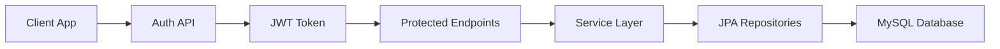

# ExamSphere

<p align="center">
  <strong>Secure online exam backend built with Spring Boot</strong>
</p>

<p align="center">
  Role-based access, JWT authentication, exam publishing, and student attempt workflows in one backend service.
</p>

<p align="center">
  
  
  
  
  
</p>

## Overview

ExamSphere is a Spring Boot backend for an online examination platform where admins create teacher accounts, teachers build and publish exams, and students take exams and review results through secured role-based APIs.

This project focuses on the backend foundation of an exam management system. It provides authentication, role-based authorization, exam authoring, published exam discovery, student attempts, and result retrieval using a REST API backed by MySQL.

## Highlights

| Area | What it does |
| --- | --- |
| Authentication | Issues JWT tokens for secure access |
| Authorization | Restricts routes by `ADMIN`, `TEACHER`, and `STUDENT` roles |
| Exam Authoring | Lets teachers create, update, delete, and publish exams |
| Exam Content | Supports passages, questions, and answer options |
| Student Workflow | Allows students to start attempts, save answers, submit, and view results |
| Persistence | Stores application data with Spring Data JPA and MySQL |

## Features

- JWT-based authentication for secure API access
- Role-based authorization for `ADMIN`, `TEACHER`, and `STUDENT`
- Student self-signup flow
- Admin-only teacher account creation
- Teacher exam management with create, update, delete, and publish actions
- Support for passages, questions, and answer options
- Student exam attempt flow with answer saving and submission
- Attempt result and exam detail responses for client applications

## Tech Stack

| Layer | Technology |
| --- | --- |
| Language | Java 21 |
| Framework | Spring Boot 4 |
| Web | Spring Web |
| Security | Spring Security + JWT |
| Data Access | Spring Data JPA |
| Database | MySQL |
| Mapping | MapStruct |
| Boilerplate Reduction | Lombok |
| Build Tool | Maven |

## Request Flow



## Project Structure

| Package | Responsibility |
| --- | --- |
| `controller` | REST endpoints for auth, users, teacher flows, and student flows |
| `service` | Business logic for authentication, exams, attempts, and users |
| `repository` | JPA access to users, exams, questions, passages, and attempts |
| `model` | Domain entities |
| `dto` | Request and response contracts |
| `config` | Security, JWT, CORS, and environment bootstrap |

## Main API Areas

### Authentication

- `POST /api/auth/login` - authenticate and receive a JWT token

### User Management

- `POST /api/users/signup` - register a student account
- `POST /api/admin/users/teachers` - create a teacher account as an admin

### Teacher APIs

- `GET /api/teacher/exams/my`
- `GET /api/teacher/exams/{examId}`
- `POST /api/teacher/exams`
- `PUT /api/teacher/exams/{examId}`
- `DELETE /api/teacher/exams/{examId}`
- `PUT /api/teacher/exams/{examId}/publish`
- `POST /api/teacher/exams/{examId}/questions`
- `PUT /api/teacher/exams/{examId}/questions/{questionId}`
- `DELETE /api/teacher/exams/{examId}/questions/{questionId}`
- `POST /api/teacher/exams/{examId}/passages`
- `PUT /api/teacher/passages/{passageId}`
- `POST /api/teacher/passages/{passageId}/questions`
- `DELETE /api/teacher/passages/{passageId}`

### Student APIs

- `GET /api/student/exams`
- `GET /api/student/exams/{examId}`
- `POST /api/student/exams/{examId}/attempts`
- `GET /api/student/attempts`
- `GET /api/student/attempts/{attemptId}`
- `POST /api/student/attempts/{attemptId}/answers`
- `POST /api/student/attempts/{attemptId}/submit`
- `GET /api/student/attempts/{attemptId}/result`

## Security Model

| Access Level | Routes |
| --- | --- |
| Public | `POST /api/auth/login`, `POST /api/users/signup` |
| Admin | `/api/admin/**` |
| Teacher | `/api/teacher/**` |
| Student | `/api/student/**` |

Requests to protected routes must include a Bearer token in the `Authorization` header.

## Quick Start

### Prerequisites

- Java 21
- Maven 3.9+
- MySQL 8+

### Environment Variables

Create a `.env` file in the project root with the following keys:

```env
DB_URL=jdbc:mysql://localhost:3306/examsphere?useSSL=false&allowPublicKeyRetrieval=true&serverTimezone=UTC
DB_USERNAME=your_mysql_username
DB_PASSWORD=your_mysql_password
JWT_SECRET=your_long_random_secret
JWT_EXPIRATION=86400000
```

### Start the Application

```bash
git clone https://github.com/your-username/examsphere.git
cd examsphere
./mvnw spring-boot:run
```

Windows:

```powershell
.\mvnw.cmd spring-boot:run
```

The API runs by default at `http://localhost:8080`.

## Database Notes

- The application uses `spring.jpa.hibernate.ddl-auto=update`
- Make sure the `examsphere` database exists before starting the app
- Update connection settings through `.env`

Example MySQL setup:

```sql
CREATE DATABASE examsphere;
```

## Example Auth Flow

1. Sign up a student with `POST /api/users/signup`, or create a teacher through an admin account.
2. Log in with `POST /api/auth/login`.
3. Copy the returned JWT token.
4. Call protected endpoints with `Authorization: Bearer <token>`.

## Testing

Run the test suite with:

```bash
./mvnw test
```

Windows:

```powershell
.\mvnw.cmd test
```

## Roadmap

- Add Swagger or OpenAPI documentation
- Add refresh token support
- Add pagination and filtering for larger exam lists
- Add Docker setup for easier local development
- Add CI workflow for automated testing

## Contributing

Contributions are welcome. If you want to improve the API, add test coverage, or extend the exam workflow, open an issue or submit a pull request with a clear description of the change.

## License

This project currently does not include a license file. Add a license such as MIT if you plan to open-source it publicly.
